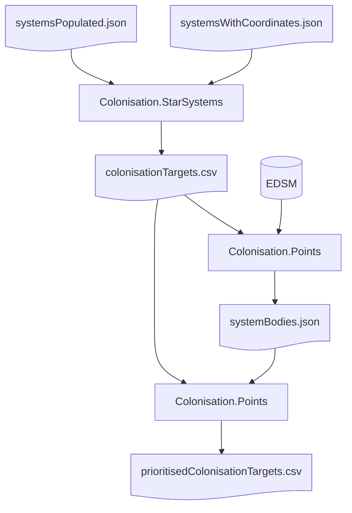

# Overview

Produce a list of potential systems for the upcoming colonisation feature for the minor faction *EDA Kunti League* in the game **Elite Dangerous**.

This consists of three command line programs (to be run in order):
1. `Colonisation.StarSystems`: This produces a list of potential colonisation systems near systems controlled by the specified minor faction. The output is CSV for easy import into Excel or a similar spreadsheet.
1. `Colonisation.Bodies`: This takes the output of `Colonisation.StarSystems` and looks up details about the bodies on EDSM. The output is in JSON, since it has a complex structure. Inara, EDSM and similar websites also provide the same information in more accessible forms.
1. `Colonisation.Points`: This takes the output of both previous commands and produces a list of systems based on an arbitrary point system to determine the most desirable systems for colonisation. The output is in a CSV.

The separation ensures long running but infrequently changing details do not impact the likely frequent fiddling and tweaking of point values.

# Use

The programs and files involved are:

1. Download and extract `systemsWithCoordinates.json` from https://www.edsm.net/dump/systemsWithCoordinates.json.gz into `Colonisation.StarSystems`. Note that this is a large file (12+ GB) at the time of writing. Such a large but rarely changing file is intentionally excluded from the git repository.
1. Download and extract `systemsPopulated.json` from https://www.edsm.net/dump/systemsPopulated.json.gz into `Colonisation.StarSystems`. This file is also excluded from the git repository.
1. (Optional) Change the `minorFactionName` setting in `Colonisation.StarSystems\applicationSettings.config` to the name of your minor faction. It must match **exactly**.
1. Build the solution.
1. Run "run.bat" in the root folder of the solution. This batch file will:
    1. Run `Colonisation.StarSystems`. It takes about four to four and a half minutes to run. By default, output is written to `colonisationTargets.csv`.
    1. Copy `colonisationTargets.csv` from the previous step into `Colonisation.Bodies` and `Colonisation.Points`. You can also load this file into any spreadsheet.
    1. Run `Colonisation.Bodies` to download relevant information about the bodies in these systems. This may take a while, mainly if https://edsm.net is busy.
    1. Copy `systemBodies.json` from the previous step into `Colonisation.Points`.
    1. Run `Colonisation.Points` to output `prioritisedColonisationTargets.csv`.

# Principles

This is a simple tool not intended for broad use. Therefore, not every parameter is stored in configuration or validated. Code is kept in a few files to keep swapping to a minimum.

# References

1. EDSM Nightly Dumps: https://www.edsm.net/en/nightly-dumps (used in the first two steps above)
1. EDSM System APIs: https://www.edsm.net/en/api-system-v1 (called by `Colonisation.StarSystems`)
1. ED Astro dumps: https://edastro.com/mapcharts/files.html (unused but potentially useful)
1. Inara API: https://inara.cz/elite/inara-api-devguide/ (unused but potentially useful)
