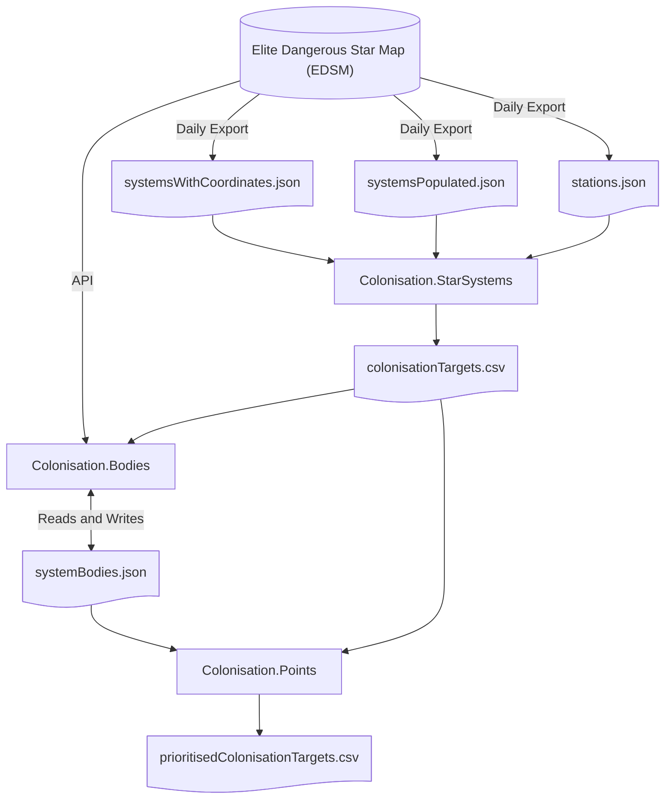

# Overview

Produce a list of potential colonisation systems for your minor faction in the game **Elite Dangerous**.

This consists of three command line programs (to be run in order):
1. `Colonisation.StarSystems`: This produces a list of potential colonisation systems near systems controlled by the specified minor faction. The output is CSV for easy import into Excel or a similar spreadsheet.
1. `Colonisation.Bodies`: This takes the output of `Colonisation.StarSystems` and looks up details about the bodies on EDSM. The output is in JSON, since it has a complex structure. It updates the existing output file, if any, to prevent unnecessary lookups, which speeds up the process.
1. `Colonisation.Points`: This takes the output of both previous commands and produces a list of systems based on an arbitrary point system to determine the most desirable systems for colonisation. The output is in a CSV.

The separation ensures long running but infrequently changing details do not impact the likely frequent fiddling and tweaking of point values.

# Use

The programs and files involved are:

1. Download and extract `systemsWithCoordinates.json` from https://www.edsm.net/dump/systemsWithCoordinates.json.gz into `Colonisation.StarSystems`. Note that this is a large file (12+ GB) at the time of writing. Such a large but rarely changing file is intentionally excluded from the git repository. The systems, particularly those within or near the bubble, are well known so this file should only need to be downloaded the first time.
1. Download and extract `systemsPopulated.json` from https://www.edsm.net/dump/systemsPopulated.json.gz into `Colonisation.StarSystems`. This file is excluded from the git repository. It changes daily and should be redownloaded regularly.
1. Download and extract `stations.json` from https://www.edsm.net/dump/stations.json.gz into `Colonisation.StarSystems`. This file is also large (7+ GB) at the time of writing and is also excluded from the git repository. This file's contents are used to detect systems being colonised by looking for a station called "System Colonisation Ship". It changes daily and should be redownloaded regularly.
1. (Optional) Change the `minorFactionName` setting in `Colonisation.StarSystems\applicationSettings.config` to the name of your minor faction. It must match **exactly**. See Configuration below for an explanation.
1. (Optional) Change the `minorFactionNativeStarSystemName` setting in `Colonisation.StarSystems\applicationSettings.config` to the name of your minor faction's native system. It must match **exactly**. See Configuration below for an explanation.
1. Build the solution.
1. Run "run.bat" in the root folder of the solution. This batch file will:
    1. Run `Colonisation.StarSystems`. It takes several minutes to run. By default, output is written to `colonisationTargets.csv`.
    1. Copy `colonisationTargets.csv` from the previous step into `Colonisation.Bodies` and `Colonisation.Points`. You can also load this file into any spreadsheet.
    1. Run `Colonisation.Bodies` to download relevant information about the bodies in these systems. This may take a while, especially if https://edsm.net is busy.
    1. Copy `systemBodies.json` from the previous step into `Colonisation.Points`.
    1. Run `Colonisation.Points` to output `prioritisedColonisationTargets.csv`.
  
`prioritisedColonisationTargets.csv` contains the following columns:

|Value|Description|
|---|---|
|Name|The potential colonisation target star system's name. Note that the system may have been claimed subsequently after the data was last updated.|
|Points|The number of points the system earned. See the Rules below.|
|Reason|A brief description of each rule that matched. Helpful if you are looking for something specific.|
|Colonise From|The name of the closest star system where your selected minor faction controls one or more outposts, installations or starports.|
|Distance from Colonising Star System|The distance, in light years, from the `Colonise From` system.|
|Distance from Native Star System|The distance, in light years, from the minor faction's native star system. See `minorFactionNativeStarSystemName` in Configuration. If you are only interested in systems close to your native star system, most spreadsheets can filter out star systems that are too far away.|

This file is sorted by Points (highest points first) and then by Name (alphabetically). This ensures the most promising star systems are at the top.

# Configuration

Important configuration parameters in `Colonisation.StarSystems\applicationSettings.config` are:

|Value|Description|
|---|---|
|minorFactionName|These tools look for potential colonisation targets for this minor faction. It is required and must match the in-game name exactly.|
|minorFactionNativeStarSystemName|The native star system for the minor faction in `minorFactionName`. It is only used to calculate the `Distance from Native System` value in `colonisationTargets.csv` output from `Colonisation.StarSystems` and `prioritisedColonisationTargets.csv` output from `Colonisation.Points`. It is required and must match the in-game name exactly.|
|colonisationRange|The distance, in light years, from which a system can be colonised. It defaults to 16, the in-game value at the time of writing and so need not be changed unless the in-game range changes. It is required and must be positive.|

Other configuration values specify file names, which need not be changed.

# Rules

The output is a spreadsheet containing a sorted list of colonisable star systems. They are ordered by an arbitrary point score that attempts to measure how valuable they are for colonisation. Specifically:
1. One point for each body in the system, including stars. This is halved if they are over 50,000 Ls away from entry.
2. Each landable planet gets twice its gravity, measured in "g"s, in points. This is doubled again if it has an atmosphere. This approximates the number of surface outposts that can be built.
3. One point for each ring and belt.
4. Twenty points for a terraformable world, mainly because it may give a terraforming state, allowing wing mining missions.

# Principles

This is a simple tool not intended for broad use. Therefore, not every parameter is stored in configuration or validated. Code is kept in a few files to keep swapping to a minimum. Error handling is minimal.

# References

1. EDSM Nightly Dumps: https://www.edsm.net/en/nightly-dumps (used in the first two steps above)
1. EDSM System APIs: https://www.edsm.net/en/api-system-v1 (called by `Colonisation.StarSystems`)
1. ED Astro dumps: https://edastro.com/mapcharts/files.html (unused but potentially useful)
1. Inara API: https://inara.cz/elite/inara-api-devguide/ (unused but potentially useful)
